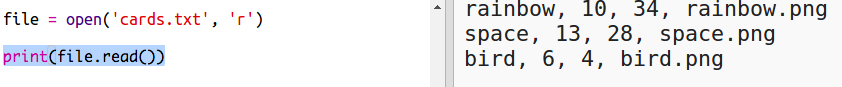
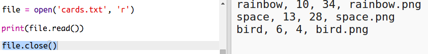
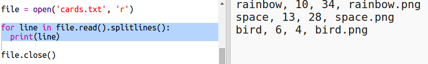

## 从文件读取机器人数据

从文件读取信息通常很有用。 然后你可以修改文件中的数据，而不必修改代码。

+ 打开此trinket代码：<a href="http://jumpto.cc/trumps-go" target="_blank">jumpto.cc/trumps-go</a>。

+ 您的入门项目包括一个`cards.txt`文件，此文件包含有关机器人的数据。
    
    点击 `cards.txt` 查看数据：
    
    
    
    每一行都包含有关机器人的数据。 数据项用逗号隔开。
    
    每行都包括如下信息：
    
    名称、智能等级、续航时间、图片文件名称

+ 让我们从文件中读取数据，以便您能使用。
    
    第一步是在您的脚本中打开`cards.txt`文件：
    
    

+ 现在您可以从文件中读取数据：
    
    

+ 每当完成数据读取，您应该始终关闭文件：
    
    

+ 每一个文件都以字符串的形式呈现，您需要将它分成独立的数据块。
    
    首先，您可以将文件内容分割为一个列表行：
    
    
    
    仔细观察输出。 表中有三项，每一项对应文件中的一行。

+ 现在您可以一次循环读取所有的行
    
    

+ 将文件读取入变量中，而不是以行的形式打印出来：
    
    

+ 您希望稍后读取这些数据来查找特定的机器人的值。 让我们使用机器人的名字作为字典的键。
    
    添加一个名为`robots`的字典：
    
    

+ 现在，让我们为每一个机器人添加一个机器人字典条目。
    
    名称为键，而值为每个机器人的数据列表。
    
    添加高亮处的代码：
    
    
    
    当你已测试过您的脚本后，您可以移除`print robots`。