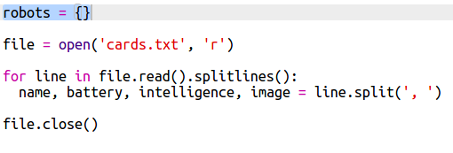

## 从文件读取机器人数据

从文件中读取信息通常很有用处。你随后可以更改文件中的数据，而无须更改你的代码。 

+ 打开这个 trinket：<a href="http://jumpto.cc/trumps-go" target="_blank">jumpto.cc/trumps-go</a>。 

+ 你的启动器项目包含一个 `cards.txt` 文件，其中包含机器人相关的数据。 

  点击 `cards.txt` 来查看数据：

  

  每行都有一个机器人的相关数据。数据条目以逗号隔开。 

  每行都包含以下信息：

  名称、智能等级、电池持续时间、图片文件名称

+ 让我们从文件中读入数据，以便你使用这些数据。 

  第一步是打开脚本中的 `cards.txt` 文件：
  
  
  
+ 现在你可以从该文件读取数据：

  
  
+ 你务必要在使用完一份文件后关闭它：

  

+ 这样可将文件视为一个字符串，你需要将其拆分成多个单独的数据段。 

  首先，你可以将文件划分成行列表：

  
  
  请仔细查看输出内容。列表中有三个项目，每个项目都是文件中的一行。 
  
+ 现在你可以每次一行来循环遍及这些行

  
  
+ 将这些行读入到变量，而非进行打印输出：

  
  
+ 你想随后能使用这个数据来查看一个特定机器人的值。让我们使用机器人的名称作为字典的键。 

  添加一个 `robots` 字典：

  
  
+ 现在针对每个机器人向机器人字典添加一个条目。 

  名称为键，值为该机器人的一系列数据。 

  添加以下高亮代码：
 
  
  
  你可以在测试完脚本之后移除 `print robots`。 

