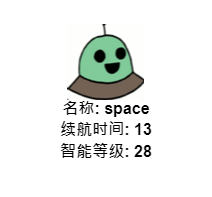
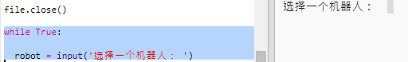
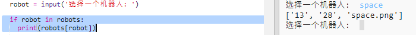
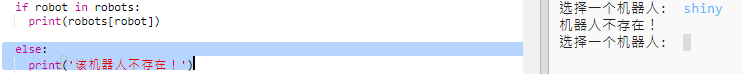
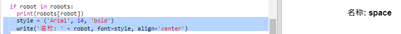
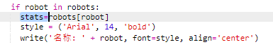
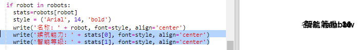
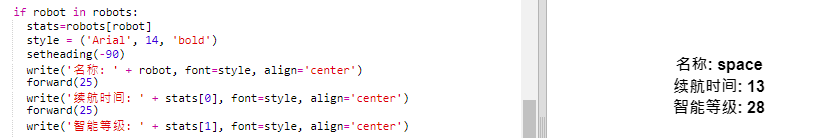
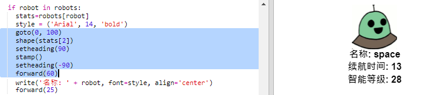
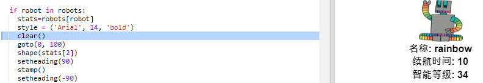

## 显示数据

现在，你可以将机器人的数据以更有趣的方式显示出来。

为了展示其智能和实用性，让我们用一张图像展示一张机器人王牌卡。

当您完成了这一步，就可以显示如下机器人了：

+ 询问用户想看到哪个机器人：
    
    

+ 如果机器人在字典中，那么查看其数据：
    
    
    
    通过输入一个机器人名称来测试代码。

+ 如果机器人不存在，则输出错误：
    
    
    
    通过输入一个字典中不存在的机器人名称来测试代码。

+ 现在，你可以使用Python turtle显示机器人数据。
    
    在您的脚本顶部导入trutle库并设置屏幕和乌龟：
    
    

+ 现在，添加代码以使乌龟打印出机器人的名称：
    
    

+ 尝试更改 `style` 变量直至你对文本满意。
    
    除了`Arial`字体，您还可以尝试：`Courier`、 `Times` 或 `Verdana`字体。
    
    更改`14`为其它数字来改变字体的大小。
    
    您可以将`bold`更改为`normal`或者`italic`。

+ 将机器人的数据列表存储于变量中，而不是打印出来：
    
    

+ 您可以通过列表中的条目来访问机器人的数据：
    
    + `stats[0]` 为智能等级
    + `stats[1]` 为续航时间
    + `stats[2]` 为图像名称
    
    添加代码以显示智能等级和续航状态：
    
    

+ 噢，我的天！ 每一个数据都重叠了。 您将需要添加代码来移动乌龟：
    
    

+ 最后，让我们添加机器人图像以完成显示。
    
    从`cards.txt`读取数据时，您将要添加一行代码来注册图像：
    
    

+ 然后添加代码来定位和标记图像：
    
    

+ 通过输入一个机器人和另一个机器人来测试您的代码，您会发现它们重叠显示了！
    
    您需要在显示机器人前清空屏幕：
    
    