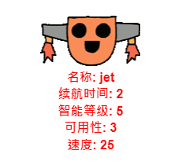

--- challenge ---
## 挑战：向机器人添加更多统计数据
你能否想出更多统计数据来添加到机器人。你可以添加“speed”（速度）或“usefulness”（实用性），或者提出自己的想法。 

你将需要：

+ 向文件添加每个新类别的数据 
+ 向读入数据的代码添加新类别
+ 在显示王牌卡时，将新类别写出来

你甚至可以添加一个颜色并将机器人的统计数据显示为机器人自身的颜色。 

提示：在编写之前使用 `color('red')` 将海龟文本变为红色。 

示例： 

 

--- /challenge ---