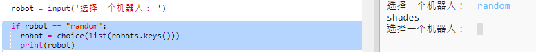

## 随机显示机器人

让我们添加一些代码，使你能在输入 Random 而非机器人名称时得到一个随机机器人。

+ 首先你将需要从随机模块导入选择函数：

  
  
+ 你可以使用 `choice` 来从机器人字典的键列表中随机选择一个机器人名称。 

  
  
+ 在 Python 3，你需要使用 `list` 来将 `keys` 结果转换为一个列表。

  提示：请务必仔细检查你的括号！

